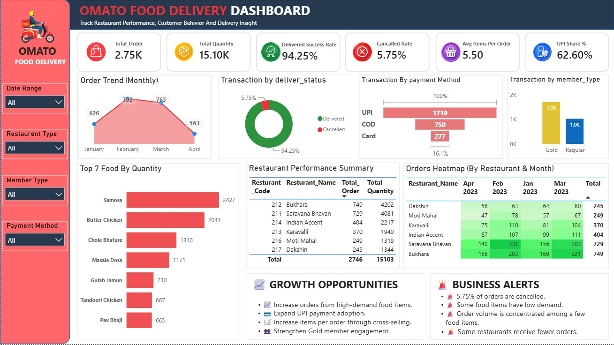

# 🍔 OMATO FOOD DELIVERY DASHBOARD

> **Transforming food delivery transaction data into actionable business insights to improve operational performance, understand customer behavior, and identify opportunities for sustainable business growth.**

---

## 📌 Project Overview

Food delivery businesses generate large volumes of order and customer data every day. However, raw transactional data alone does not provide management with the visibility required to understand operational performance, customer activity, and improvement opportunities.

The **OMATO Food Delivery Analytics Dashboard** converts food delivery transaction data into a structured Business Intelligence solution focused on:

- Order performance
- Delivery success
- Order cancellations
- Customer activity
- Repeat purchasing behavior
- Average order composition
- Payment preferences

The project follows a **business-first analytics approach**, where the objective is not simply to visualize data, but to use data to identify performance gaps, support operational improvements, and enable better business decisions.

---

## 🎯 Business Problem

Management needs clear answers to important operational and customer-related questions:

- How many orders are being generated?
- How many orders are successfully delivered?
- What percentage of orders are cancelled?
- Are customers returning to place additional orders?
- How many items are customers purchasing per order?
- How significant is UPI as a payment method?
- Where are operational performance gaps occurring?
- Which areas should management prioritize for improvement?

Without structured analysis, identifying these patterns can be time-consuming and may delay business decisions.

---

## 💡 Business Objective

The primary objective of this project is to transform transaction-level food delivery data into meaningful business intelligence that helps management:

- Monitor operational performance
- Identify delivery and cancellation issues
- Understand customer purchasing behavior
- Evaluate repeat customer activity
- Analyze order composition
- Understand payment preferences
- Identify improvement opportunities
- Support data-driven business decisions

---

## 💼 Executive Business Value

The dashboard provides management with a centralized view of critical operational and customer KPIs.

It can help decision-makers:

- **Improve delivery performance** by monitoring successful and unsuccessful orders.
- **Reduce order cancellations** by identifying areas that require operational investigation.
- **Strengthen customer retention** by analyzing repeat purchasing behavior.
- **Increase order value** by understanding average items purchased per order.
- **Understand customer payment behavior** through UPI adoption analysis.
- **Prioritize operational improvements** using measurable performance indicators.
- **Support business growth** through continuous performance monitoring and data-driven decision-making.

---

## 📊 Key Performance Indicators

| KPI | Business Purpose |
|---|---|
| **Total Orders** | Measures overall order demand |
| **Total Quantity** | Measures total items ordered |
| **Average Items Per Order** | Measures average order composition |
| **Delivered Orders** | Measures successfully completed orders |
| **Delivered Success Rate** | Measures delivery performance |
| **Cancelled Orders** | Measures unsuccessful orders |
| **Cancellation Rate** | Measures the proportion of cancelled orders |
| **Total Customers** | Measures the unique customer base |
| **Repeat Customers** | Measures repeat purchasing behavior |
| **Orders per Customer** | Measures average customer order frequency |
| **UPI Orders** | Measures orders completed through UPI |
| **UPI Share %** | Measures UPI contribution to total orders |
| **Transactions** | Measures total transaction records |

---

## 🔎 Key Business Questions

The analysis is designed to answer:

1. What is the overall order demand?
2. How efficiently are orders being delivered?
3. What proportion of orders are cancelled?
4. How strong is repeat customer activity?
5. What is the average number of items per order?
6. What payment method do customers prefer?
7. Where are potential operational gaps?
8. Which areas should management investigate for improvement?
9. How can customer experience and retention be strengthened?
10. How can operational insights support sustainable business growth?

---

## 📈 Business Improvement Opportunities

### 1. Reduce Order Cancellations

Cancellation rate can be monitored to identify potential issues related to fulfillment, delivery operations, order processing, or customer experience.

### 2. Improve Delivery Reliability

Delivered Success Rate provides a measurable indicator of service performance and can help management identify areas requiring operational improvement.

### 3. Strengthen Customer Retention

Repeat Customer analysis provides insight into customer loyalty and can support targeted retention strategies.

### 4. Increase Order Value

Average Items Per Order can help identify opportunities for:

- Product bundles
- Cross-selling
- Personalized offers
- Promotional combinations

### 5. Improve Payment Experience

UPI Share % helps management understand digital payment adoption and can support improvements to the payment and checkout experience.

---

## 📅 Data Coverage

The project contains food delivery sales data covering **January 2023 to April 2023**.

### Source Files

```text
Data/
├── January_Sales_2023.xlsx
├── February_Sales_2023.xlsx
├── March_Sales_2023.xlsx
├── April_Sales_2023.xlsx
└── Omato_Data.xlsx


```

### 🔗 Dataset

[**View Project Data →**](./Data/)

---

## 🖼️ Dashboard Preview

### OMATO Food Delivery Dashboard



### 🔗 Dashboard Preview

[**View Full Dashboard Preview →**](./OMATO_FOOD_DELIVERY_DASHBOARD_PREVIEW.jpg)

---

## 📊 KPI Visualizations

The repository contains individual KPI visualizations:

- [**Average Items Per Order**](./PNG's/AVG_Item_Per_Order.png)
- [**Cancellation Rate**](./PNG's/Cancellation_Rate.png)
- [**Delivery Success Rate**](./PNG's/Success_Rate.png)
- [**Total Orders**](./PNG's/Total_Order.png)
- [**Total Quantity**](./PNG's/Total_Quantity.png)

---

## 🛠️ Tools & Technologies

| Tool | Purpose | Business Problem Solved |
|---|---|---|
| **Microsoft Power BI** | Dashboard development, data modeling, KPI analysis, and visualization | Provides centralized visibility into operational and customer performance |
| **Power Query** | Data cleaning, transformation, and preparation | Reduces manual data preparation and handles multiple source files efficiently |
| **DAX** | Dynamic business KPI calculations | Converts raw transaction data into measurable business performance indicators |
| **Microsoft Excel** | Source data storage and transaction-level data | Provides structured operational data for analysis |
| **GitHub** | Project version control and documentation | Organizes and showcases the complete analytics workflow |

### 🔗 Detailed Tool Documentation

[**View Detailed Documentation →**](./Documentation/OMATO_Food_Delivery_Documentation.md)

---

## 🧠 Skills Demonstrated

### Data Analytics

- Data Cleaning
- Data Transformation
- KPI Development
- Operational Analysis
- Customer Analysis
- Performance Analysis
- Business Insight Generation

### Business Intelligence

- Executive KPI Design
- Dashboard Development
- Business Performance Monitoring
- Data Modeling
- Decision Support
- Data Storytelling

### Technical Skills

- Microsoft Power BI
- Power Query
- DAX
- Data Modeling
- Microsoft Excel
- GitHub

### Business Analysis

- Business Problem Identification
- Business Requirement Analysis
- KPI Definition
- Performance Gap Analysis
- Customer Behavior Analysis
- Operational Improvement
- Data-Driven Decision Making

---

## 📂 Repository Structure

```text
PowerBI-PowerQuery/
│
├── DAX/
│   ├── Calendar_Table.md
│   ├── KPI_Measure.md
│   └── gitkeep
│
├── Data/
│   ├── January_Sales_2023.xlsx
│   ├── February_Sales_2023.xlsx
│   ├── March_Sales_2023.xlsx
│   ├── April_Sales_2023.xlsx
│   ├── Omato_Data.xlsx
│   └── gitkeep
│
├── Documentation/
│   └── OMATO_Food_Delivery_Documentation.md
│
├── PNG's/
│   ├── AVG_Item_Per_Order.png
│   ├── Cancellation_Rate.png
│   ├── Omato_Food_Delivery_Preview.jpg
│   ├── Success_Rate.png
│   ├── Total_Order.png
│   └── Total_Quantity.png
│
├── OMATO_FOOD_DELIVERY_DASHBOARD.pbix
├── Omato_Food_Delivery_Preview.jpg
└── README.md


```

## 📁 Project Files

### 📊 Power BI Dashboard

[**Download / View OMATO Food Delivery Dashboard →**](./OMATO_FOOD_DELIVERY_DASHBOARD.pbix)

Main Power BI project file containing the analytical model, calculations, and dashboard.

### 📂 Dataset

[**Explore Dataset →**](./Data/)

Contains the monthly and consolidated source data used for the analysis.

### 📐 DAX Documentation

[**Calendar Table DAX →**](./DAX/Calendar_Table.md)

[**KPI Measures DAX →**](./DAX/KPI_Measure.md)

Contains the DAX logic used to calculate core business KPIs.

### 📚 Project Documentation

[**Read Complete Project Documentation →**](./Documentation/OMATO_Food_Delivery_Documentation.md)

Contains detailed business requirements, data model, DAX logic, tools, analytical approach, business interpretation, and improvement opportunities.

### 🖼️ Dashboard Images

[**Explore Dashboard Visuals →**](./PNG's/)

---

## 📚 Analytical Approach

The project follows a structured analytics workflow:

```text
Raw Transaction Data
        ↓
Data Preparation
        ↓
Data Modeling
        ↓
DAX KPI Development
        ↓
Business Performance Analysis
        ↓
Insight Identification
        ↓
Business Improvement Opportunities
        ↓
Decision Support


```

## 🔬 Analytical Scope

### Included in Current Version

- Order volume analysis
- Quantity analysis
- Average items per order
- Delivery success analysis
- Cancellation analysis
- Customer analysis
- Repeat customer analysis
- Orders per customer
- UPI order analysis
- UPI share analysis

### Planned for Future Versions

- Revenue analysis
- Profitability analysis
- Delivery-time analysis
- Geographic analysis
- Restaurant performance
- Customer lifetime value
- Customer segmentation
- Demand forecasting
- Retention and cohort analysis

---

## 🚀 Future Improvements

The analytical solution can be extended with:

- Revenue and profitability analysis
- Delivery-time performance
- Restaurant or partner performance
- Geographic demand analysis
- Peak-hour demand analysis
- Customer lifetime value
- Customer cohort analysis
- Customer retention analysis
- Advanced customer segmentation
- Order demand forecasting
- Automated KPI monitoring
- Automated business alerts
- AI-assisted business insights

These improvements would allow the project to progress from:

**Descriptive Analytics → Diagnostic Analytics → Predictive Analytics → Prescriptive Decision Support**

---

## 🔗 Quick Navigation

| Resource | Link |
|---|---|
| 📊 Power BI Dashboard | [Open Dashboard](./OMATO_FOOD_DELIVERY_DASHBOARD.pbix) |
| 📂 Dataset | [Explore Data](./Data/) |
| 📐 Calendar DAX | [View Calendar Table](./DAX/Calendar_Table.md) |
| 📐 KPI DAX | [View KPI Measures](./DAX/KPI_Measure.md) |
| 🖼️ Dashboard Preview | [View Preview](./Omato_Food_Delivery_Preview.jpg) |
| 🖼️ KPI Visuals | [Explore Visuals](./PNG's/) |
| 📚 Documentation | [Read Documentation](./Documentation/OMATO_Food_Delivery_Documentation.md) |

---

## 📖 Documentation

For detailed technical and business documentation:

[**View OMATO Food Delivery Project Documentation →**](./Documentation/OMATO_Food_Delivery_Documentation.md)

The documentation covers:

- Business Requirements
- Data Sources
- Data Preparation
- Data Model
- Calendar Table
- KPI Framework
- DAX Logic
- Tools & Technologies
- Skills Demonstrated
- Business Interpretation
- Business Improvement Framework
- Future Enhancements

---

## 👨‍💻 Project Focus

This project follows a **business-first analytics mindset**.

The objective is not simply to create charts or report historical numbers. The focus is on connecting data with business questions, identifying performance gaps, understanding customer behavior, and generating insights that can support better operational decisions and long-term business growth.

---

## 🎯 Key Takeaway

The core philosophy of this project is:

```text
Better Data
    ↓
Better Insights
    ↓
Better Decisions
    ↓
Better Business Outcomes


```
The goal is not just to build a dashboard.

**The goal is to build a decision-support solution.**

---

## ⭐ Feedback

I am continuously developing my skills in:

- Data Analytics
- Business Intelligence
- Business Analysis
- Data Visualization
- Power BI
- DAX
- Power Query

Feedback on the analytical approach, KPI selection, business interpretation, and potential improvements is welcome.

### 🔗 Connect & Explore

- **[View My GitHub Profile →](https://github.com/neerajkumar-git001)**
- **[View My LinkedIn Profile →](https://www.linkedin.com/in/neerajkumarsahu-data/)**
- **[Explore This Project →](./)**

---
